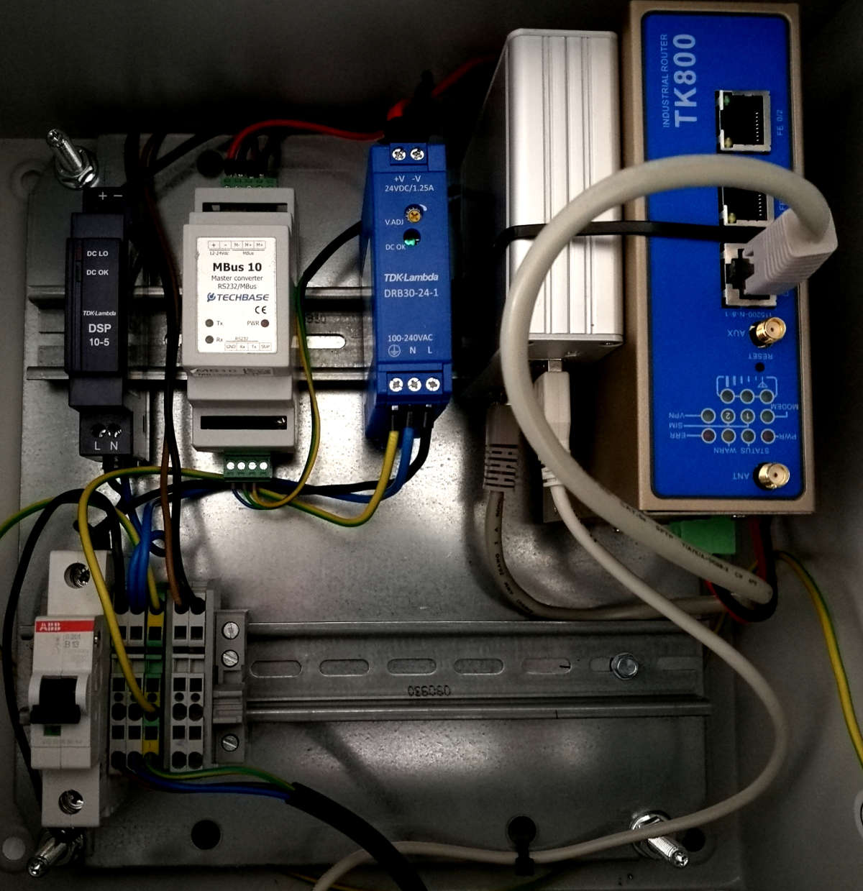

# Intro

jMBus is an implementation of the M-Bus wired and wireless protocols.
You can use it to program individual M-Bus wired masters or wireless M-Bus receivers that read meters such as gas, water, heat or electricity meters.

For M-Bus wired communication the library communicates over a serial port or USB port with an M-Bus master/level-converter device.
We have successfully tested the library with level-converters from Relay.

Wireless M-Bus communication requires a serial transceiver hardware, usually connected via USB.
Currently jMBus supports transceivers from Amber, IMST and Radiocrafts.
The library was tested with the AMB8465-M and AMB8665-M from Amber, the IM871A-USB from IMST and the RC1180-MBUS rom Radiocrafts.
The jMBus only supports passive listening for messages in modes S, T and C2 at the moment. Encryption modes 1 and 5 are supported.

<figure>

<figcaption>M-Bus master in a sample wiring.</figcaption>
</figure>

# Using jMBus

## Wired M-Bus

The first thing to do in order to communicate with a M-Bus device is to establish a new connection.
You can build a serial connection

```java
MBusSerialBuilder builder = MBusConnection.newSerialBuilder("/dev/ttyS0").setBaudrate(2400);
try (MBusConnection mBusConnection = builder.build()) {
    // read/write
}
```

or a TCP connection: 

```java
MBusTcpBuilder builder = MBusConnection.newTcpBuilder("192.168.2.15", 1234);
try (MBusConnection mBusConnection = builder.build()) {
    // read/write
}
```

Once the connection has been successfully established it can be used to read data from meters by calling the read method.
The following line reads a meter at primary address `1` by sending a `REQ_UD2` message and waiting for `RSP_UD` message response.
The variable data structure of the response is returned by the read function.

```java
int primaryAddress = 1;
mBusConnection.read(primaryAddress);
```

Next the variable data structure can be parsed as explained below.

An active connection can also be used to write data to a meter.
The following line writes `0x017a09`, by calling `SND_UD`, to a meter with primary address `5`.
This write command will change the primary address from `5` to `9`.

```java
int primaryAddress = 5;
byte[] data = { 0x01, 0x7a, 0x09 };
mBusConnection.write(primaryAddress, data);
```

## Wireless M-Bus

First a wireless connection needs to be established.
The following line creates a connection (receiver) for transceivers by Amber using mode `S`.

You can then set keys that will be automatically used to decode received messages using encryption mode 5 (AES with CBC and IV).

```java
WMBusManufacturer wmBusManufacturer = WMBusManufacturer.AMBER;
WMBusListener listener = new MyWMBusListener();
String serialPortName = "/dev/ttyUSB0";
WMBusSerialBuilder builder = new WMBusSerialBuilder(wmBusManufacturer, listener, serialPortName)
        .setMode(WMBusMode.S);

try (WMBusConnection wmBusConnection = builder.build()) {
    wmBusConnection.addKey(address, key);
}
```

The listener passed to the wireless M-Bus builder has to implement the callback method `newMessage(WMBusMessage)`.
This way the connection passes received messages to the application.

## Variable Data Structure

Before accessing elements of a variable data structure it has to be decoded using the decode method.

# How M-Bus Works

This chapter gives a short introduction into the M-Bus protocol.
Further information can be found in the standard documents (EN-13757 parts 1-4,IEC-870-5 parts 1-2) and on <http://www.m-bus.com> .

## Wired M-Bus

Wired M-Bus has a bus topology where a single master can communicate with up to 250 slaves (even more when secondary addressing is used) via a twisted pair cable.
The master communicates with a slave using voltage changes (36/24V) and a slave communicates with the master using current changes(1.0/1.5mA).
The current can optionally be used by devices as a power supply.
M-Bus devices are protected against polarity reversal and may use a baud rate between 300 Baud and 38400 Baud.
Most meters use 2400 Baud.

Wired M-Bus differentiates between five different frame types: 

- single character (the byte `0xe5` is used for confirmation purposes), 
- `SND_NKE` (send link reset),
- `SND_UD` (send user data), 
- `REQ_UD1` (request user data 1),
- `REQ_UD2` (request user data 2) and 
- `RSP_UD` (respond user data). 

The most common M-Bus message exchange is the request/response service where the master sends a `REQ_UD2` frame addressed to a specific slave (usually a meter) and the slave answers with `RSP_UD` message containing all the current measurement values.

The `REQ_UD2` frame contains only the primary address (1 byte) of the slave that is to be read.
A master cannot address certain data points it wants to read.
Instead the slave always answers with a complete list of its data.
A slave that successfully receives a `REQ_UD2` message with a matching address replies with a `RSP_UD` frame.
All other slaves that receive the request do not answer.

The `RSP_UD` frame contains the address of the slave sending the frame, a control information (CI) field equal to `0x72`, `0x78` or `0x7A` and a variable data structure that is explained further down.
The CI field may have other values if an application layer other than the M-Bus application layer is used (e.g. COSEM).
The jMBus library only supports the M-Bus application layer.

### Primary Addressing

The primary address is coded as a single byte allowing values between 0 and 255.
Addresses 1 to 250 may be assigned to slaves.
The other addresses have special purposes:

- 255 is a broadcast address.
A device that receives a message with address 255 never replies to it.
Sending `REQ_UD2` frames to the broadcast address makes therefore little sense.
- 254 is also a broadcast address.
This time all slaves shall answer requests which may lead to collisions and is only meant for testing purposes.
- 251 and 252 are reserved and should not be used for now.
- 0 is used by unconfigured slaves.
They can later be assigned to other addresses using secondary addressing.
- 253 indicates that secondary addressing is being used.

### Secondary Addressing

Unconfigured slaves usually have a primary address of 0 assigned.
In this case the master can still address the slave using secondary addressing.

Secondary addressing works using two message exchanges.
First the master sends a `SND_UD` frame addressed to primary address 253.
The `SND_UD` frame contains the secondary address of the target slave.
The addressed slave replies with a confirmation (single character).
This mechanism is called selecting a slave.
Next the master can read the slave by sending a regular `REQ_UD2` frame again to primary address 253.
Only the selected slave will answer the request.

The secondary address is a world wide unique ID of the M-Bus device.
It is 8 bytes long and consists of the following fields:

- **Identification Number** (4 bytes) - A number ranging from 00000000 to 99999999 to identify the meter.
- **Manufacturer ID** (2 bytes) - Three letters that identify the manufacturer.
- **Version** (1 byte) - Specifies the version of the device.
The version is manufacturer specific.
- **Device type** (1 byte) - This field codes the device type (e.g. electricity meter, cold water meter)

## Wireless M-Bus

Wireless M-Bus communication uses frequencies between 868 MHz and 870 MHz. 
Different physical layer modes are available. 
The two most common modes are S and T.

In S mode a meter sends messages in regular intervals (e.g. every 15 minutes or every 2hours).
Messages sent have a long message header.
If the meter is only sending messages and not listening for messages the meter is said to use the mode S1.
If the meter is also listening for messages the mode is called S2.
The S2 mode requires significantly more power.
Therefore devices using S2 are usually not battery powered.
A gateway that collects data from meters always uses the S2 mode.

In mode T the meter sends data more frequently (usually every few seconds) with a shorter message header.
Again the meter can only send data (T1) or also listen for data (T2).
A meter in T2 mode only listens for incoming messages for a short time after having sent a message.
A gateway in T2 mode will constantly listen for messages instead.

Several wireless M-Bus frame types exist: `SND-NKE`, `SND-NR`, `ACC-NR` and more.
The data frames that meters transmit in regular intervals are called `SND-NR` (send without request).
`SND-NR` is the most common frame type and it is the only frame type that jMBus supports.

The `SND-NR` frame contains the secondary address of the sender.
This uniquely identifies the sender.
Note that the sender may not necessarily be the meter that the data is originating from.
The meters secondary address can be specified in the variable data structure as explained below.
Keys used to encrypt and decrypt M-Bus messages are associated with a specific secondary address.

Finally the `SND-NR` frame contains a CI field equal to `0x72`, `0x78` or `0x7A` and a variable data structure that is explained further down.
Often the variable data structure of wireless M-Bus frames only has a short data header instead of a long header (as in wired M-Bus) because the secondary address is already transmitted in the data link layer.

## Variable Data Structure

The variable data structure is the part of an M-Bus frame that contains the measurement data.
Its format is defined as part of the M-Bus application layer in EN 13757-3.

A variable data structure consists of the following components:

### **Data Header** (optional)

Depending on the value of the CI field the variable data structure contains a long data header (CI=0x72), short data header (CI=0x7a), or no data header (CI=0x78).
The header contains mainly information about the metering device.
A short header contains the following fields:
- **Access number** (1 byte) - is a counter of how many times a meter has been read (wired M-Bus) or a meter has sent data (wireless M-Bus).
For detailed information on when the access number is incremented see EN 13757-3.
- **Status** (1 byte) - Codes the status of the metering device.
For example a device can signal that it is running out of power or is in an error state.
- **Configuration** (2 bytes) - the configuration field contains information about the encryption mode and the number of encrypted bytes. 
Wired M-Bus usually uses no encryption while wireless M-Bus meters often do. 
Only data after the data header may be encrypted.

A long data header contains the secondary address of the meter in addition to all the fields of the short header.

### **Data records** 

Data records (sometimes called variable data blocks) contain the measured data. 
Each data record is made up of a data information block (DIB), a value information block (VIB) and a value.
Similar to OBIS codes DIBs and VIBs code information such as the meaning of a value.

The DIB codes:

- **Storage number** - a meter can have several storages e.g. to store historical time series data. 
The storage number 0 signals an actual value.
- **Function** - Data can have the following four function types: instantaneous value, max value, min value, value during error state
- **Data value type** - The length and coding of the data value field following the DIB and VIB.
Possible value types are 8/16/24/32/48/64 bit integer, 32 bit real, 2/4/6/8/12 digit binary coded decimals (BCD), date and string.
In addition the value type "none" exists to label data records that have no data value field.
- **Tariff** - Indicates the tariff number of this data field.
The data of tariff 0 is usually the sum of all other tariffs.
- **Subunit** - Can be used by a slave to distinguish several subunits of the metering device.

The VIB codes:

- **Description** - The meaning of the data value (e.g. "Energy", "Volume" etc.)
- **Unit** - The unit of the data value.
  **Multiplier** - A factor by which the data value coded in the data field has to be multiplied with.

### **Manufacturer specific data** (optional)

Manufacturer specific data may optionally be appended at the end of the frame.
This is essentially an array of bytes that is not standardized by the M-Bus standard.

# Compiling jMBus

Please note that JDK 21 or later is required.
Running `mvn clean install` will build an OSGi-compatible version of the library.

# Authors

- Dirk Zimmermann
- Albrecht Schall

## Alumni:

- Stefan Feuerhahn
- Michael Zillgith
